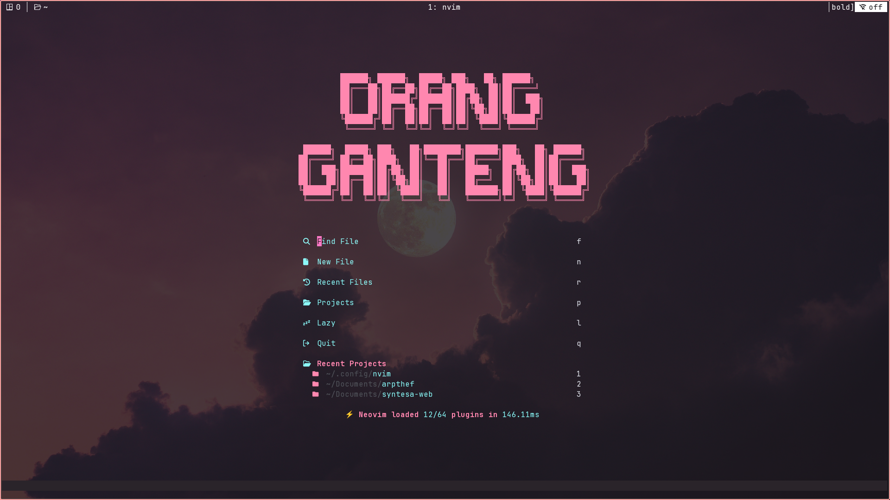
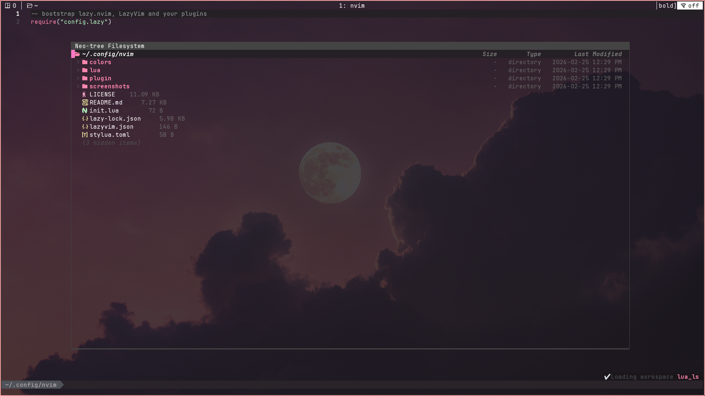
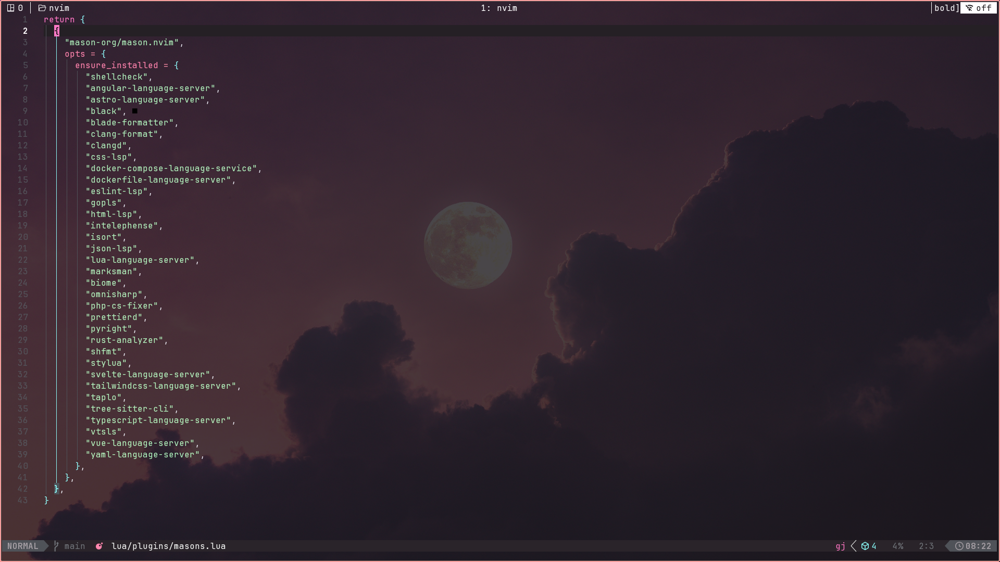

# employee.nvim

A LazyVim-based Neovim configuration optimized for modern web development and general programming. 

## About

This is my personal Neovim setup built on top of LazyVim. It's configured for full-stack development, includes support for many other languages. The goal is to have a fast, feature-rich IDE experience without leaving the terminal.

## Preview





## What's Included

**Editor Features**
- Advanced syntax highlighting via Treesitter
- Smart autocompletion with nvim-cmp
- Fuzzy finding for files and text
- Tree-based file explorer
- Code snippets support
- Multiple cursors and visual enhancements

**Code Quality Tools**
- ESLint for JavaScript/TypeScript linting
- Prettier and other formatters for automatic code formatting
- Real-time diagnostics and error checking
- Built-in LSP support for multiple languages

**Development Tools**
- Integrated debugger (DAP)
- Git integration with visual diff, blame, and staging
- Terminal emulator inside Neovim
- Testing framework integration
- Session persistence
- Project management

**Language Support**
- JavaScript/TypeScript (with JSX/TSX)
- HTML/CSS/SCSS
- Lua
- Python
- Rust
- Go
- JSON/YAML
- Markdown with live preview
- And more through LSP

## Installation Prerequisites
For Ubuntu/Debian:
```bash
sudo apt install ripgrep fd-find
```

For macOS:
```bash
brew install ripgrep fd
```

## Installation

Back up your existing config first:
```bash
mv ~/.config/nvim ~/.config/nvim.backup
mv ~/.local/share/nvim ~/. local/share/nvim.backup
```

Clone this repository:
```bash
git clone https://github.com/Ariffansyah/employee.nvim.git ~/.config/nvim
```

Start Neovim:
```bash
nvim
```

On first launch, LazyVim will automatically install all plugins.  This might take a few minutes.  Once it's done, restart Neovim and you're good to go. 

## Keybindings

The leader key is set to Space. 

### General

| Key | Action |
|-----|--------|
| `<leader>w` | Save current file |
| `<leader>q` | Quit current window |
| `<leader>Q` | Quit all |
| `<C-h/j/k/l>` | Navigate between splits |
| `<A-h/l>` | Navigate between buffers |
| `<leader>bd` | Delete current buffer |
| `<leader>bD` | Delete all buffers except current |
| `jk` or `kj` | Exit insert mode (alternative to Esc) |

### File Navigation

| Key | Action |
|-----|--------|
| `<leader>e` | Toggle file explorer |
| `<leader>ff` | Find files |
| `<leader>fg` | Live grep (search in files) |
| `<leader>fb` | Browse open buffers |
| `<leader>fr` | Recent files |
| `<leader>fs` | Search current word |
| `<leader>/` | Search in current buffer |

### LSP and Code

| Key | Action |
|-----|--------|
| `gd` | Go to definition |
| `gr` | Go to references |
| `gI` | Go to implementation |
| `gy` | Go to type definition |
| `K` | Hover documentation |
| `gD` | Go to declaration |
| `<leader>ca` | Code actions |
| `<leader>cr` | Rename symbol |
| `<leader>cf` | Format current file |
| `<leader>cd` | Line diagnostics |
| `]d` | Next diagnostic |
| `[d` | Previous diagnostic |
| `]e` | Next error |
| `[e` | Previous error |

### Git

| Key | Action |
|-----|--------|
| `<leader>gg` | Open lazygit |
| `<leader>gb` | Git blame line |
| `<leader>gd` | Git diff |
| `<leader>gs` | Git status |
| `<leader>gh` | Preview git hunk |
| `<leader>gr` | Reset git hunk |
| `<leader>gR` | Reset buffer |
| `<leader>gS` | Stage hunk |
| `]h` | Next git hunk |
| `[h` | Previous git hunk |

### Terminal

| Key | Action |
|-----|--------|
| `<C-/>` | Toggle floating terminal |
| `<leader>ft` | Open terminal in split |
| `<C-\>` | Toggle terminal (insert mode) |

### Debugging

| Key | Action |
|-----|--------|
| `<leader>db` | Toggle breakpoint |
| `<leader>dc` | Continue |
| `<leader>di` | Step into |
| `<leader>do` | Step over |
| `<leader>dO` | Step out |
| `<leader>dr` | Toggle REPL |
| `<leader>dl` | Run last |
| `<leader>du` | Toggle UI |

### Editing

| Key | Action |
|-----|--------|
| `<A-j>` | Move line down |
| `<A-k>` | Move line up |
| `<leader>uh` | Toggle inlay hints |
| `<leader>ul` | Toggle line numbers |
| `<leader>ur` | Toggle relative line numbers |
| `<leader>us` | Toggle spelling |
| `<leader>uw` | Toggle word wrap |
| `gcc` | Toggle line comment |
| `gbc` | Toggle block comment |
| `gc` | Comment (in visual mode) |

### Search and Replace

| Key | Action |
|-----|--------|
| `<leader>sr` | Search and replace |
| `<leader>sR` | Search and replace (word under cursor) |
| `n` | Next search result |
| `N` | Previous search result |
| `<Esc>` | Clear search highlight |

### Sessions

| Key | Action |
|-----|--------|
| `<leader>qs` | Save session |
| `<leader>ql` | Load last session |
| `<leader>qd` | Don't save current session |

## File Structure

```
~/.config/nvim/
├── init. lua
├── lua/
│   ├── config/
│   │   ├── options.lua       # Editor options
│   │   ├── keymaps.lua       # Keybindings
│   │   ├── lazy. lua          # Plugin manager setup
│   │   └── autocmds.lua      # Autocommands
│   └── plugins/
│       ├── editor.lua        # Editor plugins
│       ├── coding. lua        # Coding plugins
│       ├── lsp.lua           # LSP configuration
│       ├── ui.lua            # UI plugins
│       └── ...                # Other plugin configs
```

## Customization

To add your own keybindings, edit `lua/config/keymaps. lua`:

```lua
local keymap = vim.keymap. set

-- Save with Ctrl+s
keymap("n", "<C-s>", ":w<CR>", { desc = "Save file" })

-- Quick access to config
keymap("n", "<leader>fc", ":e ~/.config/nvim/init.lua<CR>", { desc = "Edit config" })
```

To change editor options, edit `lua/config/options.lua`:

```lua
vim.opt.relativenumber = true
vim.opt.tabstop = 2
vim. opt.shiftwidth = 2
vim. opt.expandtab = true
```

To modify or add plugins, create or edit files in `lua/plugins/`. LazyVim will automatically load them. 

## Common Tasks

**Installing language servers:**
```
:Mason
```
This opens the Mason UI where you can install LSP servers, formatters, and linters. 

**Updating plugins:**
```
:Lazy update
```

**Checking LSP status:**
```
:LspInfo
```

**Checking installed formatters/linters:**
```
:Mason
```

**View all keybindings:**
```
:Telescope keymaps
```

## Troubleshooting

**Plugins not loading:**
Try syncing Lazy:
```
:Lazy sync
```

**LSP not working:**
Check if the language server is installed:
```
:LspInfo
: Mason
```

**Slow startup:**
Profile your plugins:
```
:Lazy profile
```

**Something broke after an update:**
Try clearing the cache:
```bash
rm -rf ~/.local/share/nvim
rm -rf ~/. local/state/nvim
```
Then restart Neovim to reinstall everything.

**Treesitter parser issues:**
```
:TSUpdate
```

## Tips

- Use `:checkhealth` to diagnose common issues
- Press `K` twice to jump into hover documentation window
- Use `<leader>sG` to live grep with arguments (powerful for complex searches)
- Learn the LSP keybindings - they're the most useful ones
- Customize the colorscheme in your plugin config
- Use `:Telescope commands` to discover available commands
- The `which-key` plugin shows you available keybindings as you type

## Contributing

If you find bugs or have suggestions, feel free to open an issue or submit a pull request. 
